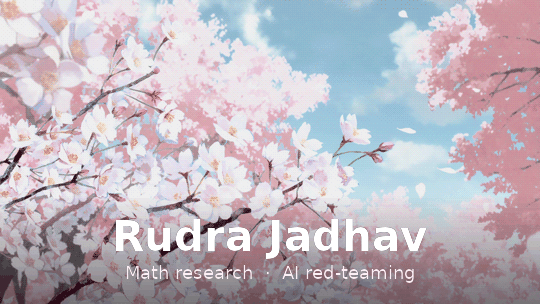

### Independent math researcher building rigor into everything, including how models get tested.

 

### Currently

- 🔢 Independent research in number theory and geometry — three preprints, three sequences accepted into the [OEIS](https://oeis.org/)
- 🛡️ Red-teaming frontier AI systems with [Gray Swan](https://www.grayswan.ai/) — ranked #1 globally on The Labyrinth (Challenge Version)
- 🌟 Contributor to [`system-prompts-and-models-of-ai-tools`](https://github.com/x1xhlol/system-prompts-and-models-of-ai-tools) — 140k+ ⭐, one of the most-starred repos on GitHub

 

### GitHub stats

 

### Reach me

